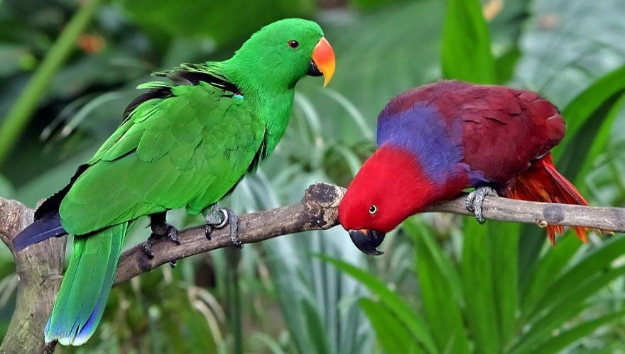
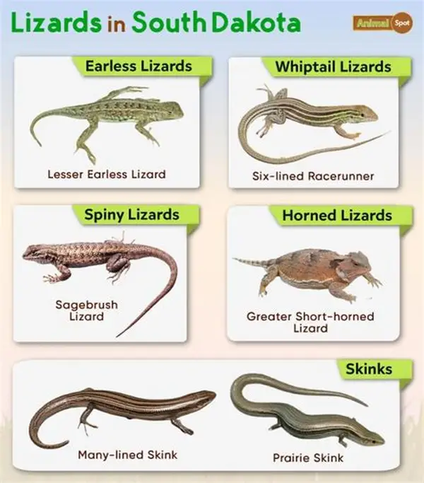
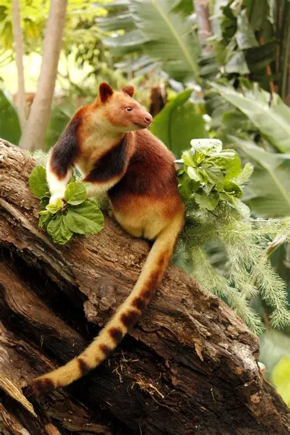
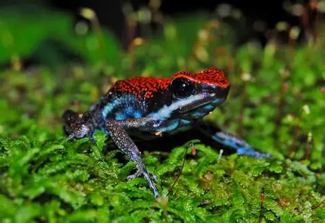

# Papua New Guinea Wildlife

# Papua New Guinea Wildlife Project

This project showcases the rich biodiversity of Papua New Guinea.  
Below are categorized images highlighting different ecosystems and species.

---

## 🐦 Birds

---

## 🐠 Marine Life

---

## 🦎 Reptiles

---

## 🌸 Plants & Insects
.jpg)

---

## 🌳 Ecosystems

.jpg)

---

## 🦘 Mammals

---

## Miscellaneous

